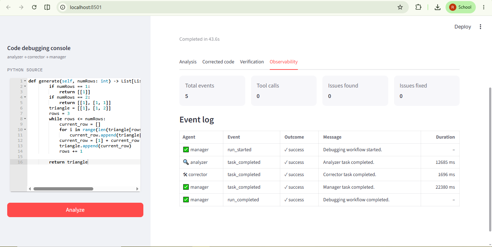
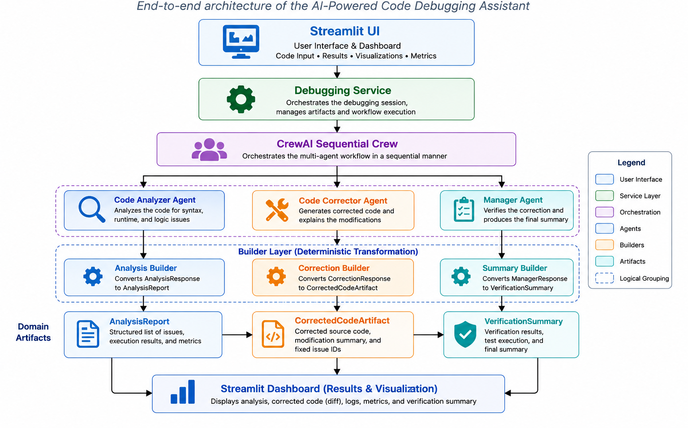
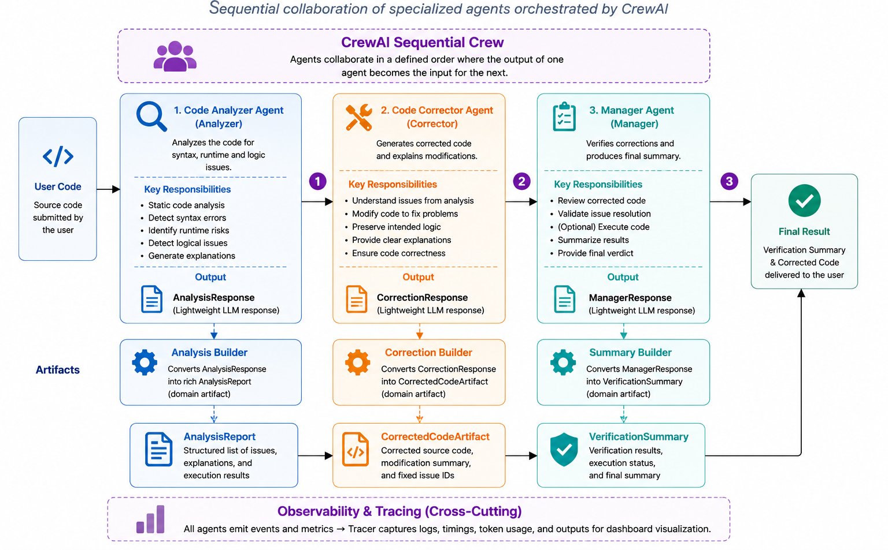
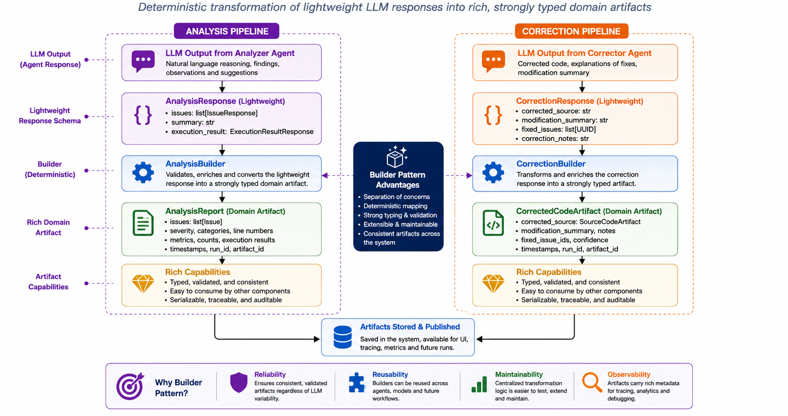
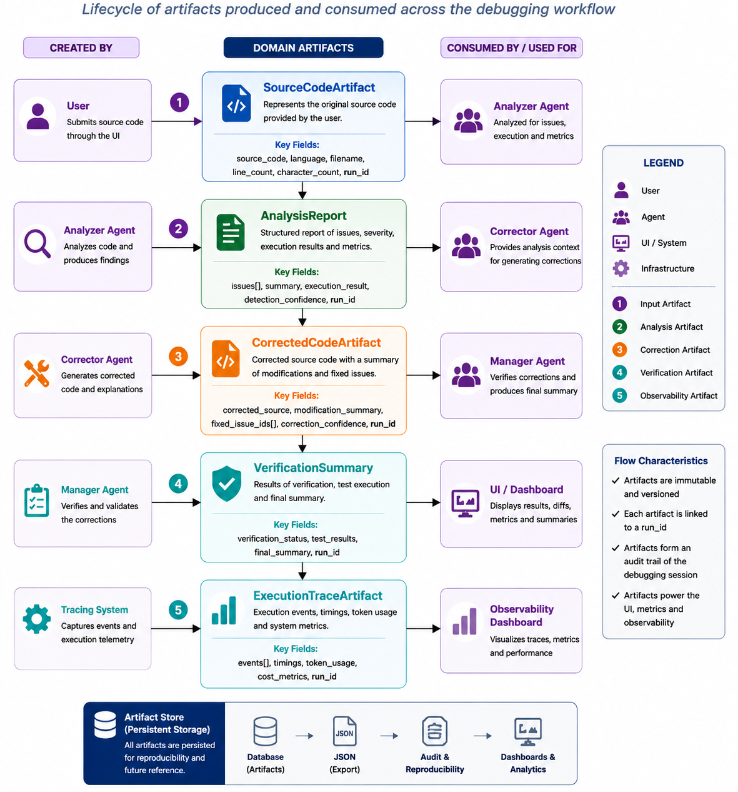
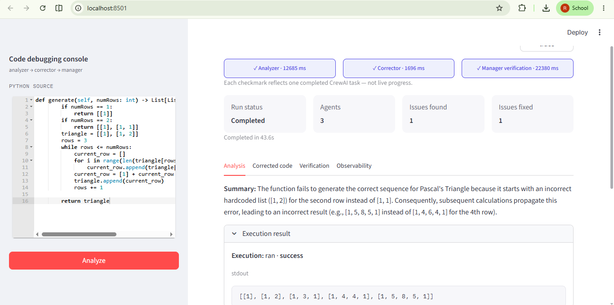
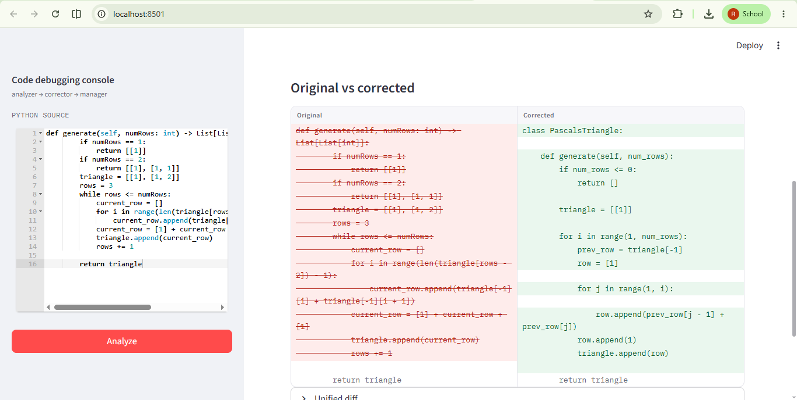
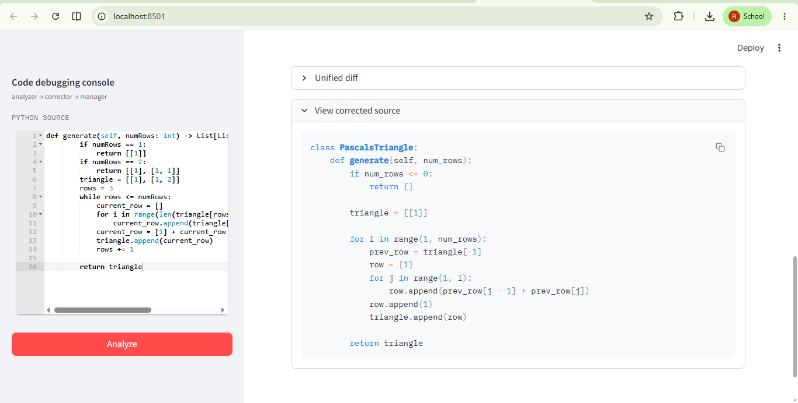
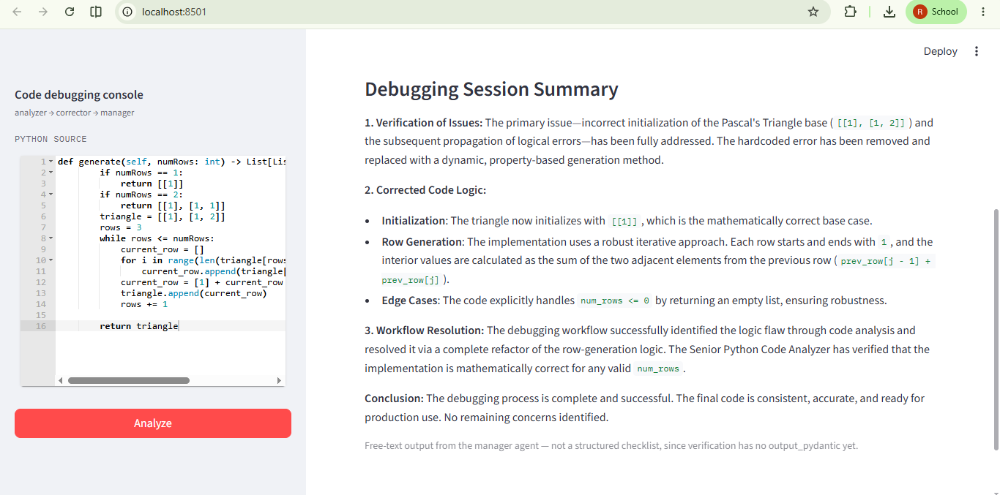
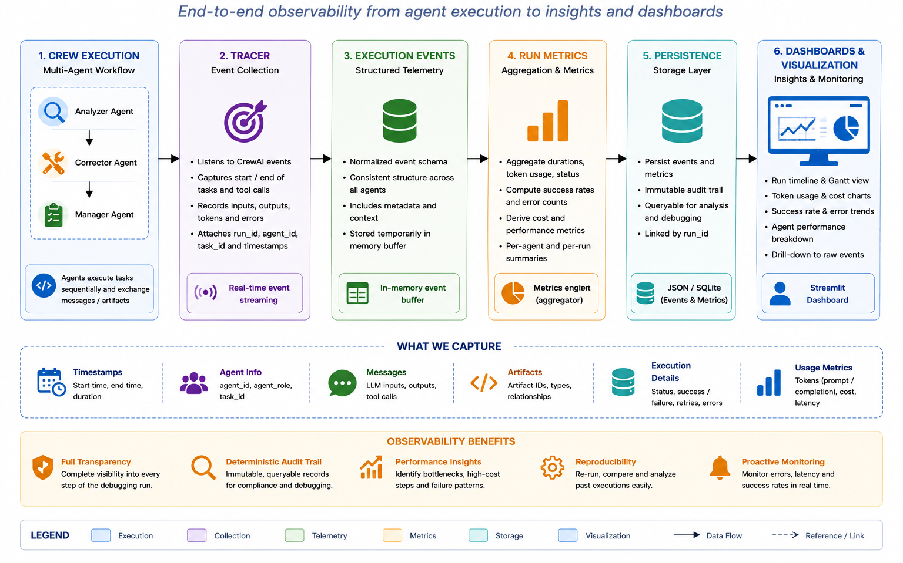

# 🤖 AI-Powered Code Debugging Assistant

> A multi-agent AI system that automatically analyzes, debugs, and corrects Python programs using **CrewAI**, **Code Interpreter**, **Pydantic**, and **Streamlit**.

<p align="center">


</p>

---

# 🎥 Demo

> **Demo Video**

[](https://youtu.be/ezaR6HkkW1w)

---

# 📖 Overview

Debugging Python programs often requires identifying syntax, runtime, and logical errors before applying safe corrections.

This project implements a **CrewAI-powered multi-agent debugging workflow** where specialized AI agents collaborate to analyze code, generate corrections, and verify the debugging process.

Unlike traditional prompt-based implementations, this project introduces a **Builder Pattern** that separates LLM reasoning from structured artifact construction, producing deterministic and strongly typed workflow outputs.

---

# ✨ Features

- 🤖 Multi-Agent AI Debugging using CrewAI
- 🔍 Automated Syntax, Runtime & Logical Error Detection
- 🛠 Automatic Code Correction
- 🧠 Code Interpreter Integration
- 📄 Builder Pattern for Structured Artifacts
- 📊 Interactive Streamlit Dashboard
- 📈 Observability & Execution Tracing
- 🔄 Side-by-Side Code Comparison
- 📑 Unified Diff Viewer
- 📦 JSON Trace Export

---

# 🏗 System Architecture

<p align="center">

</p>

The application consists of:

- Streamlit Frontend
- Debugging Service
- Sequential CrewAI Workflow
- Analyzer Agent
- Corrector Agent
- Manager Agent
- Builder Components
- Structured Pydantic Artifacts
- Observability Layer

---

# ⚙ Multi-Agent Workflow

<p align="center">

</p>

```text
                User Code
                     │
                     ▼
        ┌─────────────────────────┐
        │  Code Analyzer Agent    │
        └─────────────────────────┘
                     │
                     ▼
            AnalysisResponse
                     │
                     ▼
            AnalysisBuilder
                     │
                     ▼
             AnalysisReport
                     │
                     ▼
        ┌─────────────────────────┐
        │ Code Corrector Agent    │
        └─────────────────────────┘
                     │
                     ▼
           CorrectionResponse
                     │
                     ▼
          CorrectionBuilder
                     │
                     ▼
       CorrectedCodeArtifact
                     │
                     ▼
        ┌─────────────────────────┐
        │     Manager Agent       │
        └─────────────────────────┘
                     │
                     ▼
          Verification Summary
```

---

# 🧩 Builder Pattern

<p align="center">

</p>

One of the key architectural improvements in this project is the **Builder Pattern**.

Instead of asking the LLM to generate complex Pydantic objects directly, each agent only produces a lightweight response schema.

Dedicated Builder classes then construct rich domain artifacts.

```text
LLM
      │
      ▼
AnalysisResponse
      │
      ▼
AnalysisBuilder
      │
      ▼
AnalysisReport
```

```text
LLM
      │
      ▼
CorrectionResponse
      │
      ▼
CorrectionBuilder
      │
      ▼
CorrectedCodeArtifact
```

### Benefits

- Deterministic artifact construction
- Reduced prompt complexity
- Strong type safety
- Better maintainability
- Fewer schema validation failures

---

# 📦 Domain Artifacts

<p align="center">

</p>

The debugging workflow exchanges structured artifacts throughout execution.

```
SourceCodeArtifact

        │

        ▼

AnalysisReport

        │

        ▼

CorrectedCodeArtifact

        │

        ▼

Verification Summary
```

---

# 📊 Streamlit Dashboard


## Analysis Dashboard



---

## Code Comparison



---

## Corrected Code



---

## Verification Summary



---

## Observability Dashboard


---

# 📈 Observability

<p align="center">

</p>

The project includes a lightweight observability framework that records:

- Workflow Events
- Agent Execution
- Task Completion
- Execution Metrics
- JSON Trace Export

These metrics are visualized directly inside the Streamlit application.

---

# 🛠 Technology Stack

| Component | Technology |
|------------|------------|
| Framework | CrewAI |
| Language | Python |
| LLM | Groq Llama 3.3 70B |
| Validation | Pydantic v2 |
| UI | Streamlit |
| Execution | CodeInterpreterTool |
| Observability | Custom Tracer |

---

# 📁 Project Structure

```
code-debugging-assistant/

│

├── agents/

├── builders/

├── config/

├── observability/

├── prompts/

├── schemas/

├── services/

├── tasks/

├── utils/

│

├── images/

├── streamlit_app.py

├── crew.py

├── main.py

├── requirements.txt

└── README.md
```

---

# 🚀 Installation

Clone the repository

```bash
git clone https://github.com/ruthuraraj-ml/ai-code-debugging-assistant.git
```

Move into the project

```bash
cd ai-code-debugging-assistant
```

Create virtual environment

```bash
python -m venv .venv
```

Activate

Windows

```bash
.venv\Scripts\activate
```

Linux / macOS

```bash
source .venv/bin/activate
```

Install dependencies

```bash
pip install -r requirements.txt
```

Configure environment variables

```
GROQ_API_KEY=your_api_key
```

Run

```bash
streamlit run streamlit_app.py
```

---

# 💡 Key Learnings

This project demonstrates:

- Multi-Agent AI Systems
- CrewAI Workflow Design
- Builder Design Pattern
- Pydantic Domain Modeling
- Observability for AI Applications
- Streamlit Application Development
- Software Engineering for LLM Systems

---

# 🛣 Roadmap

### ✅ Version 1.0

- Multi-Agent Workflow
- Builder Pattern
- Structured Artifacts
- Streamlit Dashboard
- Execution Tracing
- Code Diff Viewer

### 🔄 Version 2.0

- Evaluation Benchmark Suite
- Regression Testing
- Prompt Optimization
- Improved Logical Error Detection
- Verification Artifact
- Multi-language Support

---

# 👨‍💻 Author

**Ruthuraraj R**

Assistant Professor – Mechanical Engineering

AI • Machine Learning • Generative AI • Agentic AI Systems


---

## ⭐ If you found this project interesting, consider giving it a Star.
